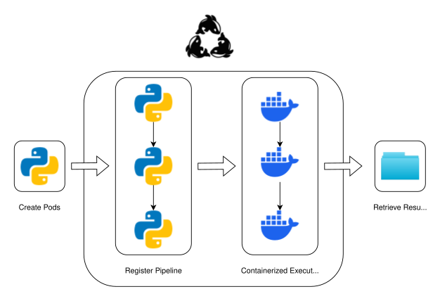

<p align="center">
  
</p>
<h1 align="center">Orcapod</h1>
<p align="center"><strong>A framework for fully traceable and reproducible scientific computation</strong></p>

## Project description

Orcapod is an open-source framework for traceable and reproducible scientific computation. Work is defined as reusable **Pods** with declared inputs and outputs, executed in containers for consistent results. **Pipelines** connect pods as graphs and can run locally or across remote **Agents**. Current demos include visualization to make runs auditable, with more formal artifact and logging support planned.

### Core features

- **Pods**: reusable compute units with named inputs and outputs
- **Pipelines**: compose pods into directed graphs
- **Agents**: distributed workers that execute pods locally or remotely in parallel, reporting live status and logs
- **Containerized execution**: consistent results across machines
- **Local orchestrator and store**: simple setup for laptop use
- **Operators**: utilities like `map` and `join` for data plumbing
- **Run records**: metadata and logs are stored for each run; artifact tracking is currently demonstrated in demo

### Advantages

- Containerization: per-analysis dependency setting
- Fault-permissible: downstream steps run all available jobs
- Platform-independent: migrate easily between local and cloud infrastructure

## Architecture



High-level workflow in Orcapod: define a Pod in Python, register it in a pipeline, execute in Docker, and retrieve results as files.

## Documentation

Full documentation is available at [orcapod.org](https://orcapod.org/).

- [Tutorials and examples]() {link pipeline doc}
- API reference (Coming Soon!)

## Installation

Set up the Orcapod development environment and run in a reproducible container.

### Prerequisites

- Docker Desktop or Docker Engine installed
- VS Code with these extensions: Dev Containers, Jupyter
- Git

### Open the repo in a dev container

```bash
git clone https://github.com/guzman-raphael/orcapod
```

1. In VS Code, open the command palette
2. Select _Dev Containers: Reopen in Container_
3. Wait for the container to build and start
4. Run notebooks inside the container

### Adding dependencies for a Pod

1. **Reuse an existing Docker image** that already has the dependencies you need (best for speed and reproducibility).
2. **Build and publish your own Docker image** with the dependencies, then point the Pod to that image (best for custom needs).
3. **Use `pip install` inside the Pod’s command** (works, but slower and less reproducible; fine for quick tests).

## Roadmap

Upcoming priorities:

- **Pythonic API**: simplify Docker work with decorators and automation that can turn Python functions into images.
- **New orchestrators**: support Kubernetes for production workloads, with Slurm and AWS ECS on the roadmap.
- **Dashboards**: Python-based GUIs and registries so users can compose pipelines visually, not only in code.
- **Observability**: richer intermediate node states and logs, better result inspection, and support for queries and data exploration.
- **Multi-agent execution**: coordinated agents in a mesh for parallelism with no single point of failure.
- **Tutorials**: invest in content to help new users succeed.

## Authors and Maintainers

- **Walker Lab**
- **Raphael Guzman** - Censibal
- (Additional contributors and contact information coming soon)

## Contributing

We welcome contributions!

### How to get started

- **Submit an issue** if you find a bug, have a question, or want to suggest a feature.

### Pull request checklist

- Item 1
- Item 2
- Item 3
